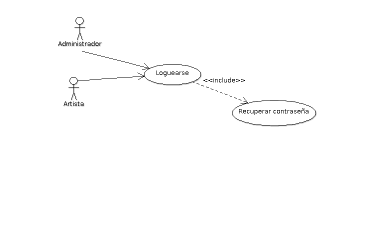
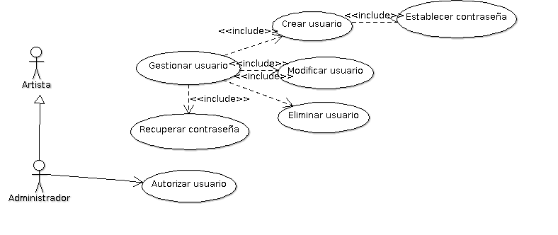
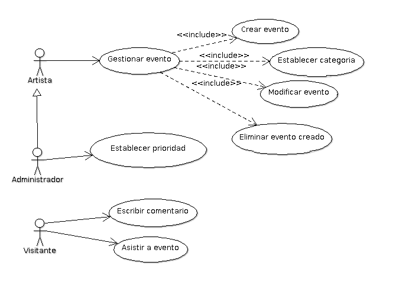
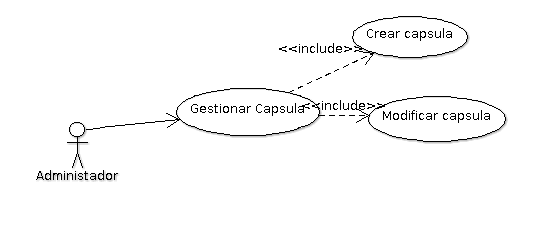
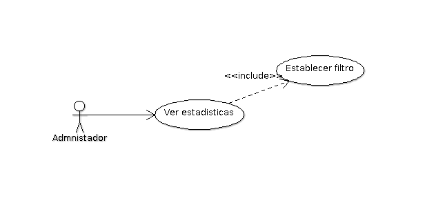
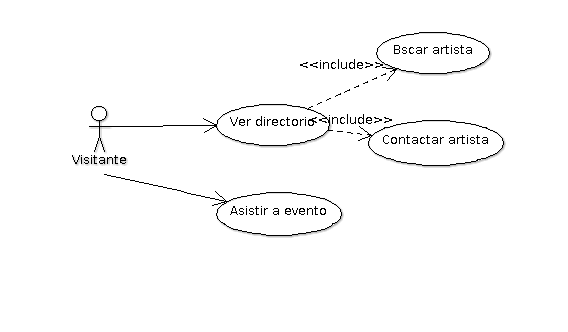

Diseño de la aplicacíon
=======================

Casos de Uso
------------

**Loguearse**: Es donde el administrador se va acceder al sistema por medio
de su usuario y contraseña, tambien puede recuperar su contraseña.

**Gestionar Usuarios**: Es donde se va a manejar todo el la gestion de este,
como la creacion de usuario, le va asignar privilegios, le puede modificar
la informacion al usuario.

**Gestionar evento**: Este caso de uso es donde se maneja todo la gestion de un
evento, como su creacion, al igual que su modificacion el evento.

**Gestionar Capsula**: Este caso de uso lo que hace es que va a manejar toda la
gestion de la capsula asi como su creacion y tambien modificacion.

**Ver Estadisticas**: Este caso de uso va a proporcionar la informacion adquiridad
por medio de estadisticas.

**Gestionar artista**: este caso de uso va a gestionar todo lo que se refiere artista.
se va a poder crear artista, ya que al comienzo no esta registrado, depues de que
este autorizado tendra la opcion de modificar su perfil, tambien como la capacidad
de crear un evento.

**Ver directorio**: el visitante va a poder ver todo el directorio de artistas,
en esta parte se muestra la visualizacion de todos los artistas, tambien
tiene la opcion de buscar un artista, esto se haria por medio de filtros,
y tambien se va a poder contartar a un artista.

Clases
------

Diagramas de clases y de sus distintas actividades, si fuese necesario.

Diagrama de BD
--------------

Diagrama de la Base de Datos que requerirá el software.
