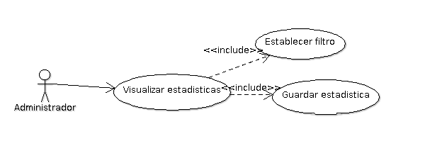
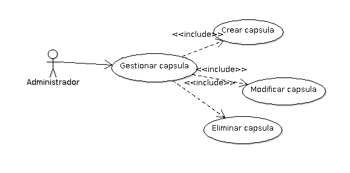

Diseño de la aplicacíon
=======================

Casos de Uso
------------

.. _referencia-a:

Usuario
++++++++++++

Es donde se va a manejar todo el la gestion de este,
como la creacion de usuario, le va asignar privilegios, le puede modificar
la informacion al usuario.

.. image:: ../imagenes/usuario.png

.. _referencia-b:

Evento
+++++++

Este caso de uso es donde se maneja todo la gestion de un
evento, como su creacion, al igual que su modificacion el evento.

.. image:: ../imagenes/evento.png

.. _referencia-c:

Directorio
+++++++++++

El visitante va a poder ver todo el directorio de artistas,
en esta parte se muestra la visualizacion de todos los artistas, tambien
tiene la opcion de buscar un artista, esto se haria por medio de filtros,
y tambien se va a poder contartar a un artista.

.. image:: ../imagenes/directorio.png

.. _referencia-d:

Estadisticas
+++++++++++++

Este caso de uso va a proporcionar la informacion adquiridad
por medio de estadisticas.

.. _referencia-e:

Notificacion
+++++++++++++

Este caso de uso lo que hace es que va a manejar toda la
gestion de la capsula asi como su creacion y tambien modificacion.

Diagrama de BD
--------------

